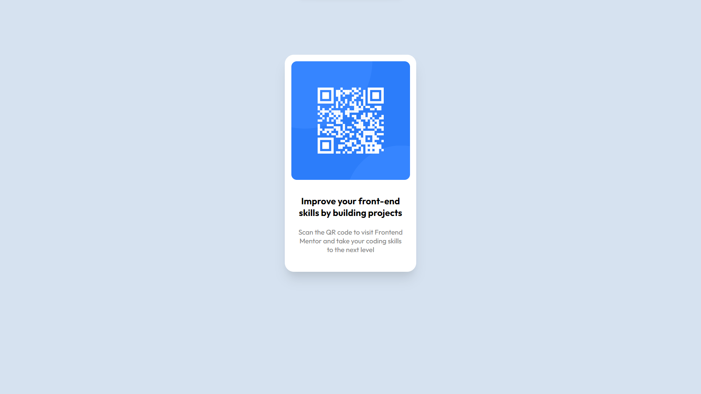

# Frontend Mentor - QR code component solution

This is a solution to the [QR code component challenge on Frontend Mentor](https://www.frontendmentor.io/challenges/qr-code-component-iux_sIO_H).

## Table of contents

- [Overview](#overview)
  - [Screenshot](#screenshot)
  - [Links](#links)
- [My process](#my-process)
  - [Built with](#built-with)
  - [What I learned](#what-i-learned)
  - [Continued development](#continued-development)
- [Author](#author)

## Overview

### Screenshot



### Links

- Solution URL: [Solution URL here](https://github.com/KusumPareek99/qr-code-component/tree/master)
- Live Site URL: [Live site URL here](https://kusumpareek99.github.io/qr-code-component/)

## My process

### Built with

- Semantic HTML5 markup
- CSS custom properties
- Flexbox

### What I learned

I learned how to make responsive a custom card using custom css.

```html
<div class="card">
  <div class="qr-code">
    
  </div>
  <div class="card-content">
    <div class="card-title">
      <p>Improve your front-end skills by building projects</p>
    </div>
    <div class="card-desc">
      <p>
        Scan the QR code to visit Frontend Mentor and take your coding skills to
        the next level
      </p>
    </div>
  </div>
</div>
```

```css
.card {
  display: flex;
  flex-direction: column;
  justify-content: center;
  align-items: center;
  background: hsl(0, 0%, 100%);
  border-radius: 20px;
  width: 260px;
  margin: 0 auto;
  margin-top: 120px;
  padding: 14px;
  box-shadow: rgba(0, 0, 0, 0.1) 0px 20px 25px -5px, rgba(0, 0, 0, 0.04) 0px 10px
      10px -5px;
}
```

### Continued development

I want to continue to deep dive in learning Flexbox and Grid box in CSS.

## Author

- Github - [Kusum Pareek](https://github.com/KusumPareek99)
